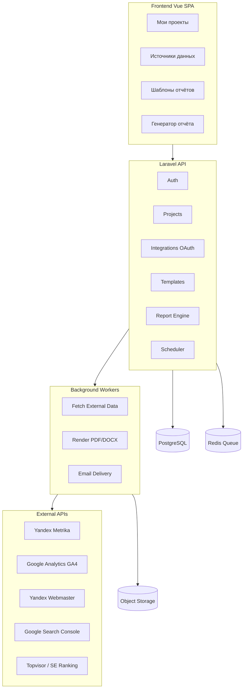
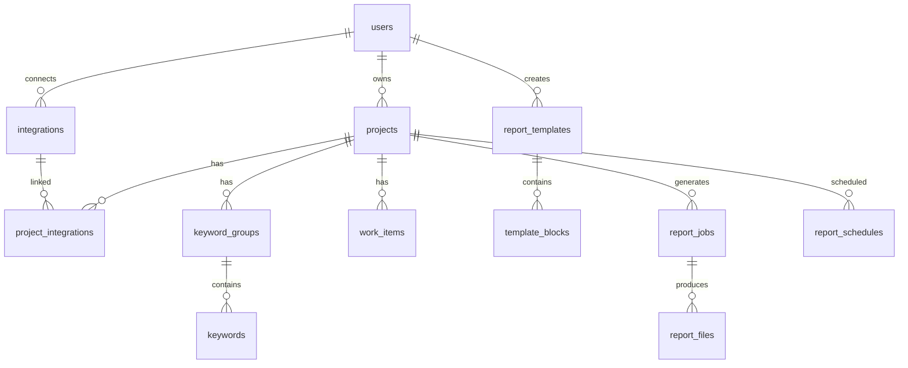
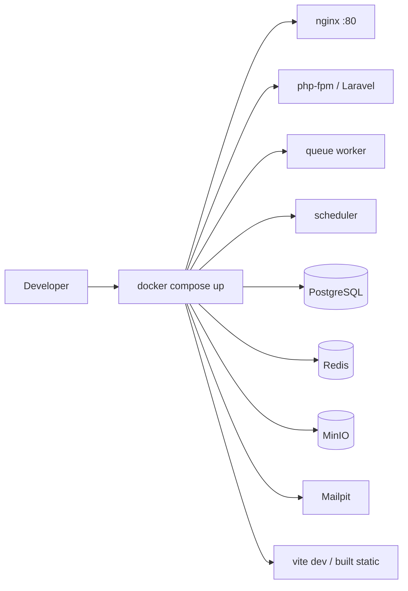
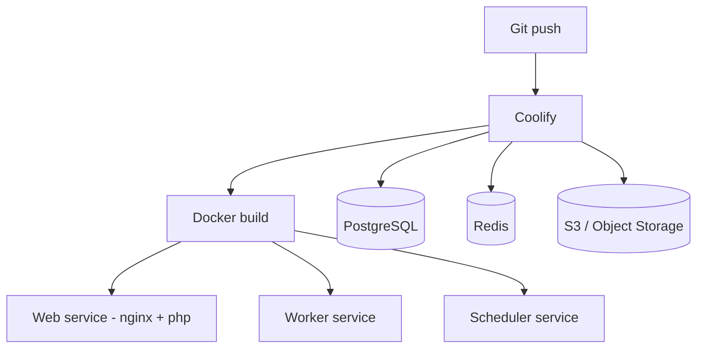
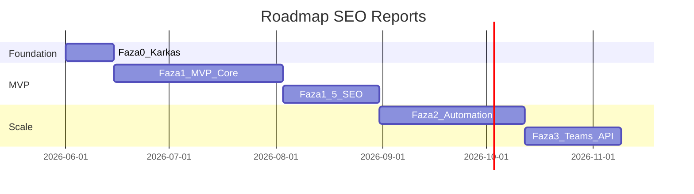

# Техническое задание: SEO Reports

> Автоматизация генерации SEO- и маркетинговых отчётов для digital-агентств и SEO-студий.  
> Референс: [seo-reports.ru](https://seo-reports.ru/)

## Оглавление

1. [Общие сведения](#1-общие-сведения)
2. [Технологический стек](#2-технологический-стек)
3. [Роли и доступ](#3-роли-и-доступ)
4. [Функциональные модули](#4-функциональные-модули)
5. [Модель данных](#5-модель-данных)
6. [API и архитектура backend](#6-api-и-архитектура-backend)
7. [Движок генерации отчётов](#7-движок-генерации-отчётов)
8. [Frontend](#8-frontend)
9. [Нефункциональные требования](#9-нефункциональные-требования)
10. [Инфраструктура и деплой](#10-инфраструктура-и-деплой)
11. [Документация проекта](#11-документация-проекта)
12. [Этапы разработки](#12-этапы-разработки)
13. [Критерии приёмки MVP](#13-критерии-приёмки-mvp)
14. [Риски и ограничения](#14-риски-и-ограничения)
15. [Структура репозитория](#15-структура-репозитория)

---

## 1. Общие сведения

### 1.1 Назначение

Веб-сервис для digital-агентств, SEO-студий и фрилансеров, который автоматически собирает данные из внешних систем (аналитика, вебмастера, трекеры позиций, рекламные кабинеты) и формирует брендированные отчёты за заданный период в PDF, DOCX, ODT и HTML.

### 1.2 Референс

Функциональный и UX-референс — [seo-reports.ru](https://seo-reports.ru/). Ключевые экраны:

- Мои проекты
- Источники данных
- Генератор отчёта
- Конструктор шаблонов

### 1.3 Отличия от референса

| Параметр | Решение |
|----------|---------|
| Тарифы | **Нет.** Доступ после регистрации, без лимитов по проектам и оплате на первом этапе |
| MVP-интеграции | Яндекс.Метрика, Google Analytics (GA4), Яндекс.Вебмастер, Google Search Console, Topvisor|
| Фаза 2 | Рекламные системы (Директ, Google Ads, VK, Facebook), Bitrix24, white-label домен |

### 1.4 Целевая аудитория

- SEO-агентства и веб-студии (10–100+ проектов)
- Фрилансеры и in-house маркетологи

### 1.5 Цели продукта

- Сократить время подготовки отчёта с 30–90 мин до 1–10 мин
- Исключить ручные ошибки при сборе данных
- Сохранять индивидуальную структуру отчёта для каждого клиента/проекта
- Хранить историю всех сгенерированных отчётов

---

## 2. Технологический стек

| Слой | Технология |
|------|------------|
| Backend | Laravel 11 (PHP 8.4+) |
| Frontend | Vue 3 + Vite + Pinia + Vue Router |
| UI / Design System | [TailAdmin Vue](https://free-vue-demo.tailadmin.com/) — Tailwind CSS admin template |
| БД | PostgreSQL 16 |
| Локальная среда | **Docker Compose** (обязательно) |
| Production | **Coolify** (self-hosted PaaS) |
| Очереди / cron | Laravel Queue + Redis + Laravel Scheduler |
| Файловое хранилище | S3-совместимое (MinIO локально, S3/Yandex Object Storage в prod) |
| PDF | DomPDF или Browsershot/Puppeteer |
| DOCX/ODT | PhpWord + LibreOffice headless (конвертация ODT) |
| Auth | Laravel Sanctum (SPA cookie/session) |
| OAuth | Laravel Socialite + кастомные провайдеры для Yandex/Google |



---

## 3. Роли и доступ

### 3.1 Роли

| Роль | Описание | Доступ |
|------|----------|--------|
| **Пользователь (User)** | Регистрация по email + пароль | Свои проекты, интеграции, шаблоны, отчёты |
| **Администратор (Admin)** | Назначается вручную (первый admin — через seeder/CLI) | Админ-панель: пользователи, настройки сервиса, все проекты |

### 3.2 Модель пользователей

- Один аккаунт = один владелец данных
- Поле `users.is_admin` (boolean) — доступ к админ-панели
- Командная работа (несколько пользователей в одном аккаунте) — **фаза 3**

### 3.3 Аутентификация

- Регистрация, вход, восстановление пароля
- Сессия через Sanctum
- Без биллинга, демо-периодов и ограничений по тарифу

---

## 4. Функциональные модули

### 4.1 Мои проекты

**Экран:** список проектов (ID, Название, URL/домен), фильтр «Без привязки к аналитике / Привязанные».

**Функции:**

- CRUD проектов
- Поля: `name` (обяз.), `domain` (опц.), `promotion_start_date` (опц.), `default_template_id` (опц.)
- При указании домена — автосвязка с counter/property из подключённых источников
- Проект можно создать без аналитики (с предупреждением)
- Переход в «Генератор отчёта»

**Acceptance criteria:**

- Пустое состояние: «Вы не добавили в систему ни одного проекта»
- Модальное окно «Добавить проект» с валидацией

### 4.2 Источники данных

**Экран:** кнопки подключения интеграций + список подключённых аккаунтов.

| Источник | Протокол | Данные |
|----------|----------|--------|
| Яндекс.Метрика | OAuth Yandex | счётчики, визиты, источники, цели, bounce rate |
| Google Analytics 4 | OAuth Google | property, sessions, users, conversions, channels |
| Яндекс.Вебмастер | OAuth Yandex | индексация, ошибки, запросы, клики, CTR |
| Google Search Console | OAuth Google | queries, impressions, clicks, CTR, pages |
| Topvisor | API key | позиции, видимость, TOP-10/30/100 |

**Функции:**

- OAuth-flow с сохранением refresh token (шифрование в БД)
- Привязка счётчика/property/сайта к проекту
- Статус: active / token_expired / error
- Переподключение и отключение

### 4.3 Шаблоны отчётов

**Экран:** конструктор (две колонки — «Доступные блоки» / «Выбранные блоки»).

**Настройки:** название, привязка к проекту, формат экспорта (PDF/DOCX/ODT/HTML), логотип.

**Категории блоков (MVP):**

| Категория | Примеры блоков |
|-----------|----------------|
| Общие | Титульная страница, оглавление, текстовый блок, «Проделанные работы» |
| Яндекс.Метрика | Обзор, источники трафика, цели |
| Google Analytics | Обзор, каналы, конверсии |
| Search Console / Вебмастер | Топ запросов, динамика кликов/показов |
| SEO / Позиции | Видимость, распределение TOP, таблица позиций |
| Экономика | CPA, стоимость заявки (MVP — ручной ввод бюджета) |

### 4.4 Генератор отчёта

**Период:** пресеты (30 дней, календарный месяц), произвольный диапазон, date picker.

**Сравнение:** предыдущий период / предыдущий месяц / произвольные даты; в отчёте Δ%.

**Действия:** СГЕНЕРИРОВАТЬ (HTML preview + async file), история, автогенерация (фаза 2).

**Acceptance criteria:**

- Генерация ≤ 30 сек (10–15 блоков)
- Статус job: queued → fetching → rendering → done
- Ошибки по блокам не ломают весь отчёт

### 4.5 Группировка ключевых запросов

- CRUD групп ключей для проекта
- Привязка ключей из Search Console / позиций
- Блок «Сегментация запросов» с агрегацией по группам

### 4.6 Проделанные работы

- CRUD: дата, описание, категория (SEO, контент, технич.)
- Блок отчёта — таблица работ за период
- Выгрузка из Bitrix24 — **фаза 2**

### 4.7 Экономические показатели

**MVP:** ручной ввод бюджета, заявок/заказов; расчёт CPA, ROI.

**Фаза 2:** автоматический расчёт из рекламных кабинетов.

### 4.8 Автогенерация и рассылка

- CRON: ежемесячно, еженедельно, custom
- Проект + шаблон + формат + email получателей
- Лог отправок, 3 retry при ошибке

### 4.9 История отчётов

- Таблица: дата, проект, период, шаблон, формат, статус, скачивание
- Хранение файлов 12 месяцев
- Просмотр HTML в браузере

### 4.10 Админ-панель

> Реализация: [TZ-faza-0.5-admin.md](./TZ-faza-0.5-admin.md)

**Доступ:** только пользователи с `is_admin = true`. Отдельный раздел в sidebar (TailAdmin).

#### 4.10.1 Пользователи (`/admin/users`)

**Экран:** таблица всех зарегистрированных пользователей.

| Колонка | Описание |
|---------|----------|
| ID | — |
| Имя | name |
| Email | email |
| Роль | User / Admin |
| Проектов | количество |
| Дата регистрации | created_at |
| Статус | active / blocked |

**Функции:**

- Поиск и фильтр по email, роли
- Просмотр профиля пользователя
- Назначение / снятие роли Admin
- Блокировка / разблокировка аккаунта
- Просмотр проектов пользователя (переход в детали)
- Удаление пользователя (с подтверждением, cascade проектов)

#### 4.10.2 Настройки сервиса (`/admin/settings`)

Глобальные настройки приложения (не путать с настройками клиентского проекта).

| Группа | Параметры |
|--------|-----------|
| Общие | Название сервиса, logo, support email |
| Регистрация | Разрешить регистрацию (on/off), подтверждение email |
| OAuth | Статус подключений Yandex/Google (read-only + ссылка на docs) |
| Хранение | Срок хранения отчётов (месяцев), max upload size |
| Ограничения | Rate limit API (запросов/мин) |
| Maintenance | Режим обслуживания (on/off + сообщение) |

Настройки хранятся в таблице `settings` (key-value jsonb) или `app_settings` singleton.

#### 4.10.3 Все проекты (`/admin/projects`) — опционально

- Список всех проектов всех пользователей (для поддержки)
- Фильтр по пользователю, домену, наличию аналитики
- Быстрый переход в генератор отчёта от имени admin (read-only просмотр)

**Acceptance criteria:**

- Обычный пользователь получает 403 на `/admin/*`
- Admin видит список пользователей и может изменить роль
- Настройки сервиса сохраняются и применяются без перезапуска
- Первый admin создаётся через `php artisan make:admin email@...`

---

## 5. Модель данных



| Таблица | Ключевые поля |
|---------|---------------|
| `users` | id, email, password, name, is_admin, is_blocked, email_verified_at |
| `projects` | id, user_id, name, domain, promotion_start_date, settings (jsonb) |
| `integrations` | id, user_id, provider, credentials (encrypted jsonb), status, expires_at |
| `project_integrations` | project_id, integration_id, external_resource_id, config (jsonb) |
| `report_templates` | id, user_id, project_id, name, export_format, logo_path, settings (jsonb) |
| `template_blocks` | id, template_id, block_type, sort_order, settings (jsonb) |
| `keyword_groups` | id, project_id, name |
| `keywords` | id, group_id, phrase, external_id |
| `work_items` | id, project_id, date, category, description |
| `report_jobs` | id, project_id, template_id, period_*, compare_*, status, error_log |
| `report_files` | id, report_job_id, format, path, size |
| `report_schedules` | id, project_id, template_id, cron, recipients (jsonb), is_active |
| `settings` | id, key, value (jsonb) |

---

## 6. API и архитектура backend

### 6.1 Структура Laravel-проекта

```
app/
  Domain/
    Projects/
    Integrations/Providers/
    Reports/Blocks/
    Reports/Renderers/
    Templates/
  Http/Controllers/Api/
  Jobs/
```

### 6.2 Паттерны

- **Strategy** — `IntegrationProviderInterface`
- **Factory** — создание блока по `block_type`
- **Pipeline** — fetch → normalize → calculate → render
- Кэш API-данных в Redis, TTL 1–6 часов

### 6.3 REST API

| Method | Endpoint | Описание |
|--------|----------|----------|
| POST | `/api/register`, `/api/login` | Auth |
| CRUD | `/api/projects` | Проекты |
| GET | `/api/integrations` | Список подключений |
| POST | `/api/integrations/{provider}/connect` | Начало OAuth |
| GET | `/api/integrations/{provider}/callback` | OAuth callback |
| CRUD | `/api/templates` | Шаблоны |
| GET | `/api/templates/blocks` | Каталог блоков |
| POST | `/api/projects/{id}/reports/generate` | Запуск генерации |
| GET | `/api/reports/{jobId}/status` | Статус job |
| GET | `/api/reports` | История |
| CRUD | `/api/projects/{id}/keyword-groups` | Группы ключей |
| CRUD | `/api/projects/{id}/work-items` | Проделанные работы |
| CRUD | `/api/schedules` | Расписания |
| GET/PATCH/DELETE | `/api/admin/users` | Admin: пользователи |
| GET/PUT | `/api/admin/settings` | Admin: настройки сервиса |
| GET | `/api/admin/projects` | Admin: все проекты |

---

## 7. Движок генерации отчётов

### 7.1 Pipeline

1. **Resolve** — проект, шаблон, блоки, интеграции
2. **Fetch** — параллельные запросы к API (Bus::batch)
3. **Transform** — нормализация в `ReportDataset`
4. **Calculate** — сравнение периодов, KPI, группировка ключей
5. **Render** — HTML → PDF/DOCX/ODT
6. **Store** — S3 + `report_files`

### 7.2 Блок как класс

```php
interface ReportBlockInterface {
    public function supports(Project $project, array $integrations): bool;
    public function fetch(Period $period, ?Period $compare): BlockData;
    public function render(BlockData $data): HtmlFragment;
}
```

---

## 8. Frontend

### 8.1 Маршруты

| Route | Компонент |
|-------|-----------|
| `/login`, `/register` | Auth |
| `/projects` | ProjectsList |
| `/projects/:id/generate` | ReportGenerator |
| `/integrations` | DataSources |
| `/templates`, `/templates/:id/edit` | TemplatesList, TemplateEditor |
| `/reports` | ReportHistory |
| `/schedules` | Schedules |
| `/admin/users` | AdminUsers |
| `/admin/settings` | AdminSettings |
| `/admin/projects` | AdminProjects |

### 8.2 UI-kit: TailAdmin

**Дизайн-система:** [TailAdmin Vue Demo](https://free-vue-demo.tailadmin.com/) — Vue 3 + Tailwind CSS admin dashboard template.

Функциональная структура экранов — по референсу [seo-reports.ru](https://seo-reports.ru/), визуальный стиль — TailAdmin.

| Элемент TailAdmin | Использование в SEO Reports |
|-------------------|----------------------------|
| Sidebar layout | Основная навигация: Проекты, Источники, Шаблоны, Отчёты, Расписания |
| Header + user dropdown | Профиль, выход |
| Data Tables | Списки проектов, история отчётов, интеграции |
| Modals | Добавление проекта, настройки блока |
| Forms / Inputs | Auth, генератор, конструктор шаблонов |
| Cards | Empty states, stat blocks в отчётах |
| Date picker / Calendar | Выбор отчётного периода |
| Alerts / Badges | Статусы интеграций, job progress |
| Dark mode (опц.) | Поддержка при наличии в TailAdmin |

**Правила:**

- Переиспользовать компоненты и паттерны TailAdmin, не писать UI с нуля
- Кастомизация цветов через Tailwind config (primary brand color)
- Desktop-first, адаптив sidebar → hamburger на tablet/mobile
- Страницы auth (`/login`, `/register`) — layout TailAdmin sign-in

---

## 9. Нефункциональные требования

| Параметр | Требование |
|----------|------------|
| Производительность | Генерация ≤ 30 сек (MVP) |
| Доступность | 99.5% uptime |
| Безопасность | HTTPS, шифрование OAuth-токенов, CSRF, rate limiting |
| Локализация | RU (default), i18n-ready |
| GDPR/152-ФЗ | Политика ПДн, cookies, удаление аккаунта |

---

## 10. Инфраструктура и деплой

### 10.1 Локальная разработка — Docker Compose

Вся локальная среда **только через Docker**. Нативный PHP/Node на хосте не требуется.



**Сервисы `docker-compose.yml`:**

| Сервис | Назначение |
|--------|------------|
| `app` | PHP 8.3-FPM, Laravel, Composer |
| `nginx` | Reverse proxy: `/api` → app, `/` → frontend |
| `worker` | `php artisan queue:work` |
| `scheduler` | `php artisan schedule:work` |
| `postgres` | PostgreSQL 16 |
| `redis` | Queue + cache |
| `minio` | S3-compatible storage (отчёты, логотипы) |
| `mailpit` | Перехват email (auth, рассылка) |
| `frontend` | Vite dev server (hot reload) или build |

**Команды:**

```bash
docker compose up -d          # поднять стек
docker compose exec app php artisan migrate
docker compose exec app php artisan test
docker compose logs -f worker
```

Подробнее: [docs/development/docker.md](./docs/development/docker.md)

### 10.2 Production — Coolify

Production-деплой через **[Coolify](https://coolify.io/)** (self-hosted PaaS на VPS).



**Архитектура в Coolify:**

| Resource | Тип | Описание |
|----------|-----|----------|
| `seo-reports-web` | Application (Dockerfile) | Nginx + PHP-FPM + static frontend |
| `seo-reports-worker` | Application (same image, diff command) | `queue:work` |
| `seo-reports-scheduler` | Application (same image, diff command) | `schedule:work` |
| PostgreSQL | Coolify Database / external | Managed PG |
| Redis | Coolify Database / external | Queue + cache |
| S3 | External (MinIO / Yandex / AWS) | Файлы отчётов |

**Конфигурация:**

- `Dockerfile` — multi-stage: frontend build → PHP runtime
- `docker-compose.prod.yml` — reference для Coolify services
- Environment variables через Coolify UI (secrets)
- Health check: `GET /api/health`
- SSL: автоматически через Coolify (Let's Encrypt)
- Custom domain: через Coolify DNS / CNAME

Подробнее: [docs/deployment/coolify.md](./docs/deployment/coolify.md)

### 10.3 CI/CD

- **GitHub Actions:** lint, tests, build frontend on PR
- **Deploy:** push to `main` → Coolify webhook auto-deploy (или manual trigger)
- Workers и scheduler — отдельные Coolify services с тем же Docker image

---

## 11. Документация проекта

Документация ведётся **на протяжении всей разработки**, обновляется при каждом значимом изменении.

### 11.1 Структура

| Документ | Назначение | Когда обновлять |
|----------|------------|-----------------|
| [TZ.md](./TZ.md) | Техническое задание | При изменении scope |
| [docs/README.md](./docs/README.md) | Оглавление документации | При добавлении разделов |
| [docs/development/setup.md](./docs/development/setup.md) | Быстрый старт для разработчика | Фаза 0 |
| [docs/development/docker.md](./docs/development/docker.md) | Docker Compose, команды, troubleshooting | Фаза 0 |
| [docs/deployment/coolify.md](./docs/deployment/coolify.md) | Деплой в Coolify, env vars, services | Фаза 0 |
| [docs/design/tailadmin.md](./docs/design/tailadmin.md) | UI-kit, компоненты, кастомизация | Фаза 0 |
| [docs/api/README.md](./docs/api/README.md) | REST API endpoints | Фаза 1 |
| [docs/integrations/README.md](./docs/integrations/README.md) | OAuth-провайдеры, scopes, setup | Фаза 1 |
| [docs/architecture/overview.md](./docs/architecture/overview.md) | Архитектура, pipeline отчётов | Фаза 1 |
| [docs/architecture/report-blocks.md](./docs/architecture/report-blocks.md) | Каталог блоков отчёта | Фаза 1 |
| CHANGELOG.md | История изменений по версиям | Каждый релиз |

### 11.2 Правила

- README в корне — краткий overview + ссылка на `docs/`
- Каждая новая интеграция → файл в `docs/integrations/`
- Каждый новый API endpoint → обновление `docs/api/`
- Env variables документируются в `.env.example` **и** в deployment docs
- PR не мержится без обновления docs (если затронут scope/API/infra)

---

## 12. Этапы разработки

Детальное описание каждого этапа — в отдельных файлах:

| Этап | Файл | Срок | Суть |
|------|------|------|------|
| **Фаза 0** | [TZ-faza-0-karkas.md](./TZ-faza-0-karkas.md) | ~2 нед. | Каркас, auth, layout, CRUD проектов |
| **Фаза 0.5** | [TZ-faza-0.5-admin.md](./TZ-faza-0.5-admin.md) | ~1–2 нед. | Админ-панель: пользователи, настройки |
| **Фаза 1** | [TZ-faza-1-mvp-core.md](./TZ-faza-1-mvp-core.md) | ~6–8 нед. | OAuth, шаблоны, генератор, PDF, история |
| **Фаза 1.5** | [TZ-faza-1.5-seo.md](./TZ-faza-1.5-seo.md) | ~3–4 нед. | Позиции, ключи, работы, KPI, DOCX/ODT |
| **Фаза 2** | [TZ-faza-2-automation.md](./TZ-faza-2-automation.md) | ~4–6 нед. | Расписание, реклама, Bitrix24, white-label |
| **Фаза 3** | [TZ-faza-3-teams-api.md](./TZ-faza-3-teams-api.md) | опц. | Команды, роли, public API |



---

## 13. Критерии приёмки MVP

1. Регистрация и создание проекта
2. Подключение Яндекс.Метрики и/или GA4 через OAuth
3. Подключение Search Console / Вебмастер
4. Создание шаблона в конструкторе, загрузка логотипа
5. Генерация отчёта с периодом и сравнением
6. Скачивание PDF, просмотр HTML
7. История генераций
8. Topvisor/SE Ranking — блок позиций в отчёте

---

## 14. Риски и ограничения

| Риск | Митигация |
|------|-----------|
| GA4 Reporting API — квоты, задержка 24–48ч | Кэш, fallback |
| Yandex OAuth — модерация приложения | Заранее зарегистрировать app |
| PDF с графиками | Chart.js → PNG server-side |
| Topvisor/SE Ranking — разные API | Абстракция провайдера позиций |
| Без тарифов | Rate limiting, fair-use policy |

---

## 15. Структура репозитория

```
seo-reports/
  TZ.md                      # Техническое задание
  TZ-faza-*.md          # Этапы разработки
  CHANGELOG.md               # История изменений
  README.md                  # Быстрый overview
  backend/                   # Laravel 11
  frontend/                  # Vue 3 + TailAdmin + Vite
  docker/
    Dockerfile               # Multi-stage (frontend + PHP)
    docker-compose.yml       # Локальная разработка
    docker-compose.prod.yml  # Reference для Coolify
    nginx/
  docs/
    README.md                # Оглавление документации
    development/             # Docker, setup
    deployment/              # Coolify
    design/                  # TailAdmin
    api/                     # REST API
    integrations/            # OAuth-провайдеры
    architecture/            # Архитектура, блоки отчётов
```
