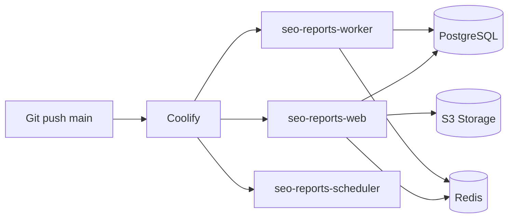

# Production — Coolify

## Обзор

Production-деплой через [Coolify](https://coolify.io/) — self-hosted PaaS.



## Services в Coolify

Из одного Docker image (`docker/Dockerfile`, target: production) создаются **3 application**:

### 1. Web (`seo-reports-web`)

| Параметр | Значение |
|----------|----------|
| Build | Dockerfile, target `production` |
| Port | 80 |
| Health check | `GET /api/health` |
| Domains | `app.example.com` (+ SSL via Coolify) |

### 2. Worker (`seo-reports-worker`)

| Параметр | Значение |
|----------|----------|
| Same image | да |
| Start command | `php artisan queue:work --sleep=3 --tries=3 --max-time=3600` |
| Replicas | 1–2 |

### 3. Scheduler (`seo-reports-scheduler`)

| Параметр | Значение |
|----------|----------|
| Same image | да |
| Start command | `php artisan schedule:work` |
| Replicas | 1 |

## Databases

| Resource | Рекомендация |
|----------|--------------|
| PostgreSQL | Coolify PostgreSQL service или external managed |
| Redis | Coolify Redis service или external |

## Object Storage

Production: внешний S3 (Yandex Object Storage, AWS S3, MinIO на отдельном VPS).

```env
FILESYSTEM_DISK=s3
AWS_ACCESS_KEY_ID=
AWS_SECRET_ACCESS_KEY=
AWS_DEFAULT_REGION=
AWS_BUCKET=seo-reports
AWS_ENDPOINT=          # для S3-compatible
AWS_USE_PATH_STYLE_ENDPOINT=true
```

## Environment Variables

Задаются в Coolify UI (Secrets). Шаблон — `backend/.env.production.example`.

**Обязательные для prod:**

```env
APP_ENV=production
APP_DEBUG=false
APP_URL=https://app.example.com
FRONTEND_URL=https://app.example.com
APP_KEY=                    # php artisan key:generate --show

SESSION_DOMAIN=.example.com
SESSION_SECURE_COOKIE=true
SANCTUM_STATEFUL_DOMAINS=app.example.com

DB_CONNECTION=pgsql
DB_HOST=
DB_PORT=5432
DB_DATABASE=
DB_USERNAME=
DB_PASSWORD=

REDIS_HOST=
REDIS_PASSWORD=

QUEUE_CONNECTION=redis
FILESYSTEM_DISK=s3
TEMPLATE_LOGO_DISK=s3

# OAuth
YANDEX_OAUTH_CLIENT_ID=
YANDEX_OAUTH_CLIENT_SECRET=
GOOGLE_OAUTH_CLIENT_ID=
GOOGLE_OAUTH_CLIENT_SECRET=

# Mail
MAIL_MAILER=smtp
MAIL_HOST=
MAIL_PORT=
MAIL_USERNAME=
MAIL_PASSWORD=
```

## Deploy Flow

1. Push в `main` → Coolify webhook (auto-deploy) или manual trigger
2. Coolify build: `docker build -f docker/Dockerfile --target production`
3. Frontend собирается внутри Dockerfile (`npm run build`), nginx отдаёт статику из `/var/www/frontend`
4. Web-сервис: порт **80**, default CMD запускает nginx + php-fpm
5. Worker / Scheduler: override start command (см. выше)
6. Миграции: post-deploy command `php artisan migrate --force`
7. Health check `GET /api/health` проходит → traffic switch

## Post-deploy commands

```bash
php artisan migrate --force
php artisan config:cache
php artisan route:cache
php artisan view:cache
php artisan storage:link
```

## Custom Domain (White-label, фаза 2)

- Добавить domain в Coolify → Let's Encrypt SSL
- Для клиентских доменов: CNAME → Coolify proxy + middleware определения tenant

## Мониторинг

- Coolify built-in logs для каждого service
- Health endpoint: `/api/health` → `{ "status": "ok", "db": "ok", "redis": "ok" }`
- Queue failed jobs: `php artisan queue:failed` (через Coolify terminal)
