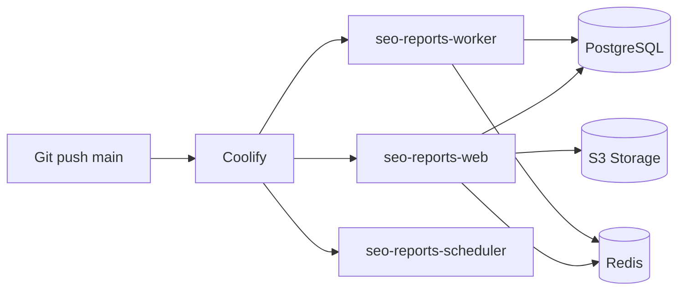

# Production — Coolify

## Обзор

Production-деплой через [Coolify](https://coolify.io/) — self-hosted PaaS.



## Coolify v4 — пошагово: worker

В v4.0.0 **нет** поля Start Command во Advanced. Worker создаётся как **второе Application** с env `CONTAINER_ROLE=worker`.

### 1. Web (уже есть)

- **Custom Docker Options** — **пусто** (убери `php artisan queue:work...`)
- **CONTAINER_ROLE** — `web` или не задавай (default)
- Домен: `https://seo-report.mv-deploy.ru`

### 2. Worker (новое приложение)

1. Project → **+ New** → **Application** → Public Git → `maksim994/seo-reports`, branch `main`
2. **General:** Build Pack Dockerfile, `/Dockerfile`, target `production` — как у web
3. **Domains** — удалить / не указывать (worker не публичный)
4. **Environment Variables:**
   - Скопировать все env с web
   - Добавить: `CONTAINER_ROLE=worker`
5. **Healthcheck** — **Disable**
6. **Deploy**

### 3. Проверка

Logs worker → `Processing: App\Jobs\GenerateReportJob`

---

## Services в Coolify

Из одного Docker image создаются **3 application**.

**Build settings (General):**

| Параметр | Значение |
|----------|----------|
| Base Directory | `/` (корень репозитория) |
| Dockerfile | `Dockerfile` (симлинк на `docker/Dockerfile`) |
| Docker Build Target | `production` |
| Port | 80 |

> Coolify по умолчанию ищет `./Dockerfile` в корне. Если указать только `docker/Dockerfile` — тоже работает.

**Build-time env:** переменные вроде `APP_ENV=production` лучше пометить как **Runtime only** в Coolify (BuildKit предупреждает, что prod env на этапе сборки может мешать).

### 1. Web (`seo-reports-web`)

| Параметр | Значение |
|----------|----------|
| Build | Dockerfile, target `production` |
| Port | 80 |
| Health check | `GET /api/health` |
| Domains | `app.example.com` (+ SSL via Coolify) |

### 2. Worker (`seo-reports-worker`)

| Параметр | Значение |
|----------|----------|
| Same image | да (новое Application в том же Project) |
| Domains | **не назначать** |
| Healthcheck | **выключить** |
| Environment | `CONTAINER_ROLE=worker` + те же env, что у web |

> **Coolify v4.0.0:** отдельного поля Start Command нет. Worker запускается через env `CONTAINER_ROLE=worker` (см. `docker/production-entrypoint.sh`).

Альтернатива (если UI позволяет без кавычек): Custom Docker Options → `--entrypoint php` — не рекомендуется, ломает наш entrypoint.

| Параметр | Значение |
|----------|----------|
| Replicas | 1–2 |

### 3. Scheduler (`seo-reports-scheduler`)

| Параметр | Значение |
|----------|----------|
| Same image | да |
| Domains | не назначать |
| Healthcheck | выключить |
| Environment | `CONTAINER_ROLE=scheduler` |
| Replicas | 1 |

## Databases

| Resource | Рекомендация |
|----------|--------------|
| PostgreSQL | Coolify PostgreSQL service или external managed |
| Redis | Coolify Redis service или external |

## Object Storage

Production: внешний S3 (Beget, Yandex Object Storage, AWS S3, MinIO).

```env
FILESYSTEM_DISK=s3
REPORTS_STORAGE_DISK=s3
TEMPLATE_LOGO_DISK=s3

AWS_ACCESS_KEY_ID=
AWS_SECRET_ACCESS_KEY=
AWS_DEFAULT_REGION=ru1
AWS_BUCKET=your-bucket-name
AWS_ENDPOINT=https://s3.ru1.storage.beget.cloud
AWS_USE_PATH_STYLE_ENDPOINT=true
AWS_PREFIX=seo-report
```

Файлы в бакете: `seo-report/reports/{id}/report.pdf`, `seo-report/templates/{id}/logo.png`.

## Environment Variables

Задаются в Coolify UI (Secrets). Шаблон — `backend/.env.production.example`.

**Обязательные для prod:**

```env
APP_ENV=production
APP_DEBUG=false
APP_URL=https://app.example.com
FRONTEND_URL=https://app.example.com
APP_KEY=                    # php artisan key:generate --show

SESSION_DOMAIN=.example.com
SESSION_SECURE_COOKIE=true
SANCTUM_STATEFUL_DOMAINS=app.example.com

DB_CONNECTION=pgsql
DB_HOST=
DB_PORT=5432
DB_DATABASE=
DB_USERNAME=
DB_PASSWORD=

REDIS_HOST=
REDIS_PASSWORD=

QUEUE_CONNECTION=redis
FILESYSTEM_DISK=s3
TEMPLATE_LOGO_DISK=s3

# OAuth
YANDEX_OAUTH_CLIENT_ID=
YANDEX_OAUTH_CLIENT_SECRET=
GOOGLE_OAUTH_CLIENT_ID=
GOOGLE_OAUTH_CLIENT_SECRET=

# Mail
MAIL_MAILER=smtp
MAIL_HOST=
MAIL_PORT=
MAIL_USERNAME=
MAIL_PASSWORD=
```

## Deploy Flow

1. Push в `main` → Coolify webhook (auto-deploy) или manual trigger
2. Coolify build: `docker build -f docker/Dockerfile --target production`
3. Frontend собирается внутри Dockerfile (`npm run build`), nginx отдаёт статику из `/var/www/frontend`
4. Web-сервис: порт **80**, default CMD запускает nginx + php-fpm
5. Worker / Scheduler: override start command (см. выше)
6. Миграции: post-deploy command `php artisan migrate --force`
7. Health check `GET /api/health` проходит → traffic switch

## Post-deploy commands

```bash
php artisan migrate --force
php artisan config:cache
php artisan route:cache
php artisan view:cache
php artisan storage:link
```

## Custom Domain (White-label, фаза 2)

- Добавить domain в Coolify → Let's Encrypt SSL
- Для клиентских доменов: CNAME → Coolify proxy + middleware определения tenant

## Мониторинг

- Coolify built-in logs для каждого service
- Health endpoint: `/api/health` → `{ "status": "ok", "db": "ok", "redis": "ok" }`
- Queue failed jobs: `php artisan queue:failed` (через Coolify terminal)
